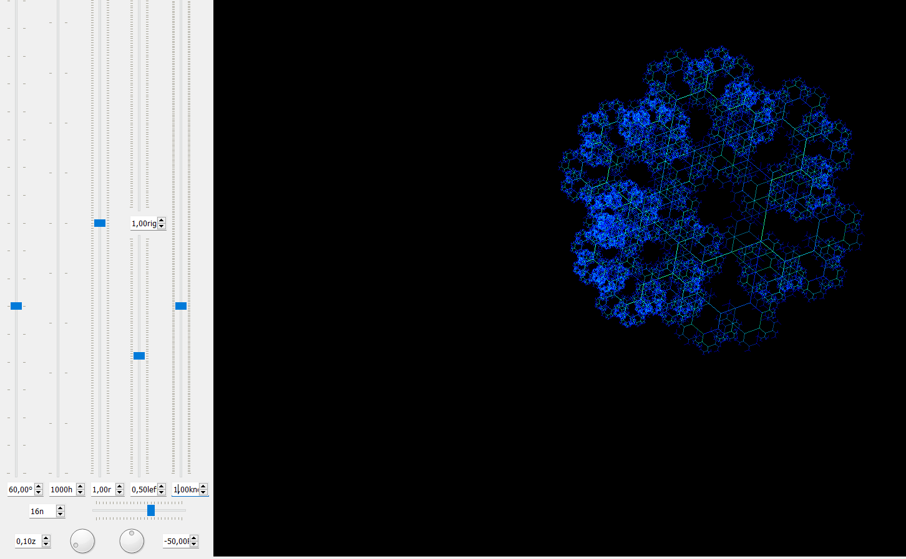
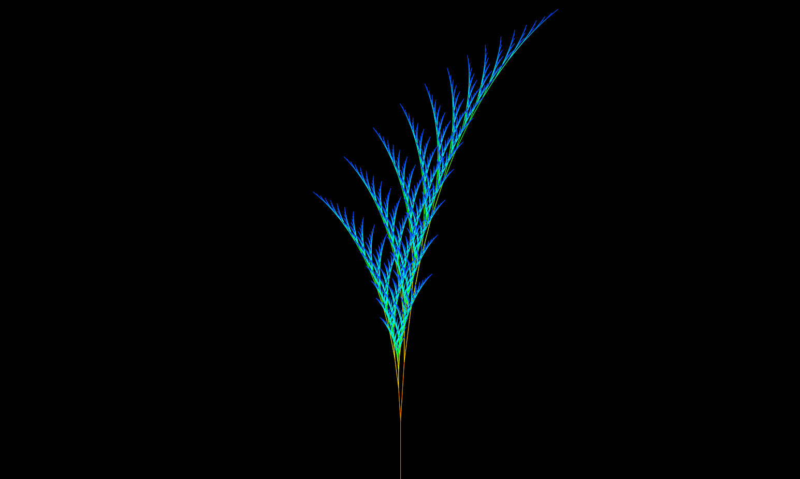

# Interactive Fractal Generator

[](https://www.python.org/)
[](https://pypi.org/project/PyQt5/)
[](LICENSE)
[](../../releases/latest)

Interactive desktop application for generating, exploring and exporting fractals in real time.

Built with **Python** and **PyQt5**.

---

## Preview



---

## Demo

Real-time parameter editing:



Additional generation example:


---

## Features

### Fractal generation

- Interactive fractal tree generation.
- Recursive depth control.
- Branch angle control.
- Left and right branch ratio controls.
- Zoom and positioning controls.
- Live parameter editing through a PyQt5 GUI.

### Rendering options

- Antialiasing toggle.
- Optional left/right branch distinction.
- HSV-based color control.
- Brush thickness control.
- Multiple painter modes:
  - line,
  - circle,
  - rectangle,
  - triangle.

### Positioning

The generated fractal can be positioned on a 9-point canvas grid:

| Top Left | Top Center | Top Right |
|---|---|---|
| Middle Left | Center | Middle Right |
| Bottom Left | Bottom Center | Bottom Right |

### Export

- Save generated fractals as **SVG**.
- SVG output is vector-based, so it can be scaled to very large sizes without losing quality.
- Useful for high-resolution previews, printing workflows and further editing in vector graphics tools.

---

## Download

The latest packaged Windows build is available on the [Releases](../../releases/latest) page.

1. Download the latest `windows-x64.zip` archive.
2. Extract the full archive.
3. Run:

```text
main.exe
```

> Do not extract only `main.exe`. The bundled dependencies from the ZIP archive are required.

---

## Run from source

### Requirements

- Python 3.x
- PyQt5
- NumPy
- SciPy
- pandas

### Setup

```bash
python -m venv .venv
.venv\Scripts\activate
pip install -r requirements.txt
python main.py
```

On Linux/macOS, virtual environment activation is different:

```bash
source .venv/bin/activate
```

> The current source version is Windows-first because the original project uses Windows-specific console handling.

---

## Project structure

```text
Interactive-Fractal-Generator/
├── main.py
├── FractalTreeClass.py
├── requirements.txt
├── README.md
├── LICENSE
├── screenshots/
│   ├── preview.png
│   ├── demo.gif
│   └── demo2.gif
├── examples/
└── docs/
    └── whiteboard.jpg
```

---

## Technical notes

The application is split into two main Python files:

- `main.py` — application entry point and PyQt5 user interface.
- `FractalTreeClass.py` — fractal tree rendering logic and drawing behavior.

The original project was created as an interactive desktop tool for experimenting with fractal parameters visually instead of generating static images from a script.

---

## Development notes

Early design notes are archived in [`docs/whiteboard.jpg`](docs/whiteboard.jpg).

---

## License

This project is licensed under the [MIT License](LICENSE).
